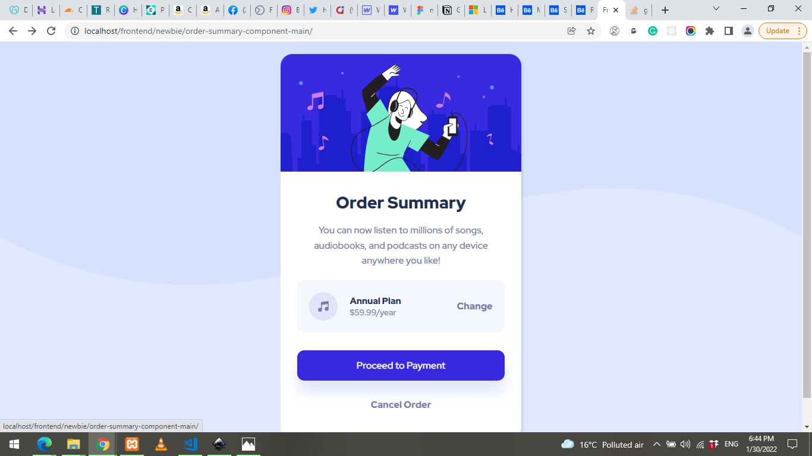
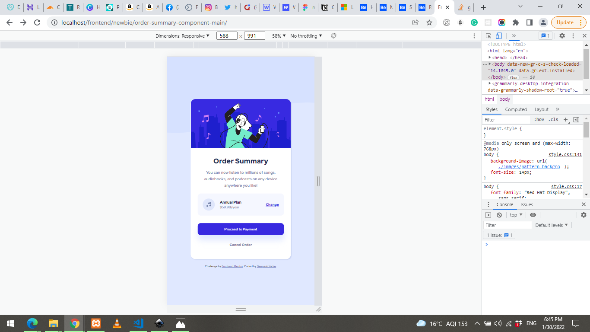

# Frontend Mentor - Order summary card solution


## Welcome! 👋

This is a solution to the [Order summary card challenge on Frontend Mentor](https://www.frontendmentor.io/challenges/order-summary-component-QlPmajDUj). Frontend Mentor challenges help you improve your coding skills by building realistic projects.

## Table of contents

- [Overview](#overview)
  - [The challenge](#the-challenge)
  - [Screenshot](#screenshot)
  - [Links](#links)
- [My process](#my-process)
  - [Built with](#built-with)
  - [What I learned](#what-i-learned)
  - [Continued development](#continued-development)
- [Author](#author)

## Overview

### The challenge

The challenge is to build out this order summary card component and get it looking as close to the design as possible.

Users should be able to:

- See hover states for interactive elements

### Screenshot





### Links

- Solution URL: [Codepen solution](https://codepen.io/deepeshyadav/pen/BamovLa)
- Live Site URL: [Github pages Live](https://deepeshyadavrd.github.io/order-summary-component/)

## My process

### Built with

- Semantic HTML5 markup
- CSS custom properties
- Flexbox
- CSS Grid
- Mobile-first workflow

### What I learned

```html
<h1>Some HTML code I'm proud of</h1>
```

```css
.plan-box {
  background-color: var(--very-pale-blue);
  border-radius: 12px;
  display: flex;
  padding: 20px;
  align-items: center;
  justify-content: space-between;
}
```

### Continued development

I want to do more mobile first projects to practice more CSS and do JavaScript. Will continue Frontend Mentor challenges to improve HTML and CSS.

## Author

- Website - [Deepesh Yadav](https://deepeshyadavrd.carrd.co)
- Frontend Mentor - [@deepeshyadavrd](https://www.frontendmentor.io/profile/deepeshyadavrd)
- Twitter - [@mrbigtech](https://www.twitter.com/mrbigtech)
- Codepen - [@deepeshyadav](https://codepen.io/deepeshyadav)
